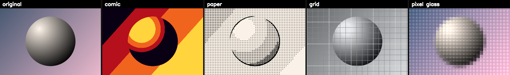

# Hand Frame FX

<div align="center">


### Hold up your hands like you're framing a shot — a live visual effect appears only in the space between your fingertips.



</div>

Hand Frame FX turns a webcam into a gesture-controlled effects window. MediaPipe tracks both hands in real time; the four fingertips it finds (thumb tip + index tip, one hand each) are wrapped into a quadrilateral, and one of four cinematic looks renders **only** inside that shape — everything outside it stays a normal camera feed. Bring your hands together and pull them apart to cycle to the next look. Pinch one hand and the window collapses into a triangle. Detection is deliberately forgiving: a loose L, a claw, or a fully open palm all register — only a closed fist won't.

---

## Table of Contents

- [Features](#features)
- [Requirements](#requirements)
- [Installation](#installation)
- [Usage](#usage)
  - [Controls](#controls)
  - [The Framing Gesture](#the-framing-gesture)
- [The Effects](#the-effects)
- [How It Works](#how-it-works)
  - [Hand Tracking and the Frame Shape](#hand-tracking-and-the-frame-shape)
  - [Smoothing and Dropout Handling](#smoothing-and-dropout-handling)
  - [Switching Effects](#switching-effects)
  - [Rendering and Compositing](#rendering-and-compositing)
  - [Performance Budget](#performance-budget)
  - [Recording](#recording)
- [Generating a Preview](#generating-a-preview)
- [Customization](#customization)
- [Project Structure](#project-structure)
- [Troubleshooting](#troubleshooting)
- [Limitations](#limitations)
- [Built With](#built-with)
- [License](#license)

## Features

- **Real-time gesture tracking** on MediaPipe's 21-point hand landmark model, run in its fastest ("lite") mode
- **4 built-in looks** — pop-art comic, ink-and-paper stipple, technical blueprint grid, and glossy pixel-glass tiles
- **Gesture-driven switching** — bring your hands together, then apart, to cycle effects; no keyboard required (though `space` works too)
- **One-hand pinch** collapses the quadrilateral into a triangle for a different frame shape
- **Jitter-free tracking** via exponential smoothing and a short grace period for brief detection dropouts
- **Built-in recording** (`r`) that always plays back at real time, independent of your machine's actual processing speed
- **Tuned for responsiveness** — a half-resolution detection pass and a resolution-capped effect renderer keep it smooth on a laptop CPU
- **One-shot contact sheet generator** (`make_contact_sheet.py`) to preview every effect side by side without waving your arms around

## Requirements

- Python 3.9 – 3.12
- A webcam, on a machine you can run this on directly — it opens an OpenCV window and reads a live camera feed, so it needs to run locally, not in a headless container or remote sandbox
- Windows, macOS, or Linux (MediaPipe 0.10.21 ships wheels for all three)

| Package | Version | Role |
|---|---|---|
| `opencv-python` | `>=4.8,<4.10` | Webcam capture, image processing, video I/O |
| `mediapipe` | `==0.10.21` | Hand landmark tracking. Hard-pinned — 0.10.30+ dropped the legacy `mp.solutions` API this project is built on |
| `numpy` | `>=1.24,<2.0` | Array/image math. Capped below 2.0 because `mediapipe==0.10.21` requires it |

## Installation

```bash
python3 -m venv venv
source venv/bin/activate      # Windows: venv\Scripts\activate
pip install -r requirements.txt
python3 hand_frame_fx.py
```

## Usage

### Controls

| Input | Action |
|---|---|
| Bring both hands together, then spread them apart | Advance to the next effect |
| `Space` | Same, triggered manually |
| `R` | Start / stop recording (saved next to the script) |
| `L` | Toggle the hand-landmark skeleton debug overlay |
| `Q` | Quit |

### The Framing Gesture

Raise both hands into frame. A loose L, a claw, or an open palm all work — the only pose that's ignored is a closed fist. For each hand, MediaPipe's thumb tip and index fingertip are taken as anchor points; the four anchors across both hands are wrapped in a convex hull, and the current effect renders only inside that hull. Move your hands and the window follows. Pinch one hand's thumb and index together and that corner collapses to a point, turning the quadrilateral into a triangle.

To switch looks, bring your two hands close together, then spread them back apart. See [Switching Effects](#switching-effects) for exactly how that distance is measured.

## The Effects

The preview at the top of this page shows, left to right: the original frame, then each effect in cycle order.

| # | Name | Look |
|---|---|---|
| 1 | **Comic** | Flat pop-art posterization in red, orange, and yellow — a histogram-equalized, posterized luminance channel run through a custom gradient lookup table |
| 2 | **Paper** | Black ink outlines (adaptive threshold) over a hand-built dot-stipple shading pattern, tinted like warm cream paper |
| 3 | **Grid** | Contrast-boosted greyscale with a cool color cast, overlaid with a blueprint-style technical grid (every 4th line drawn bolder) |
| 4 | **Pixel Glass** | A frosted, saturation-boosted base broken into ~30-column glass tiles, each with a diagonal glossy highlight |

Press `space`, or bring your hands together and apart, to cycle through them in that order.

## How It Works

### Hand Tracking and the Frame Shape

MediaPipe Hands runs in its fastest mode (`model_complexity=0`) against a half-resolution copy of each frame (`DETECT_SCALE = 0.5`), tracking up to 2 hands and 21 landmarks each. Only two landmarks per hand matter here: the index fingertip and the thumb tip. `hand_anchor()` applies no pose gate at all — whatever MediaPipe detects becomes a valid anchor, which is what makes the gesture so forgiving. With two hands detected, those four points go through `cv2.convexHull` to get the frame polygon: a quadrilateral normally, a triangle if one hand is pinched.

### Smoothing and Dropout Handling

Raw landmark positions jitter frame to frame, so each corner is smoothed with an exponential moving average (`SMOOTH = 0.55`) instead of drawn raw. If hand detection drops out for a moment — a hand grazes the frame edge, motion blur, a brief occlusion — the last known shape is held for up to `HOLD_FRAMES = 5` frames before the effect window disappears, enough to ride out a blink-length dropout without visible flicker.

### Switching Effects

Effect switching is proximity-based, not press-based. Each hand's index+thumb midpoint is tracked, and the distance between the two hands is normalized by a per-hand scale reference (wrist-to-index-knuckle distance) into a "gap" measured in hand-widths — so the trigger distance is consistent whether you're close to the camera or far from it. Crossing below `NEAR_ON = 1.5` hand-widths advances to the next effect (with a `CHANGE_COOLDOWN = 5`-frame cooldown so it can't double-fire); crossing back above `NEAR_OFF = 2.6` re-arms it for the next switch. The gap between those two thresholds is deliberate hysteresis — without it, hovering near the trigger distance would rapid-cycle through effects.

### Rendering and Compositing

Each effect only ever runs on the bounding-box crop of the hull, not the full frame, and is masked back in with `cv2.fillConvexPoly` so the visible result follows the actual quadrilateral or triangle — not just its bounding rectangle. Compositing is a hard-edged boolean copy with no feathered blend, which is what gives the effect its crisp "window into another image" look.

### Performance Budget

Two resolution caps keep this real-time on a laptop CPU: hand detection runs on a frame downscaled by `DETECT_SCALE`, and each effect itself is capped at `FX_MAX_DIM = 420` px on its longest side — a large hand-quad gets downscaled before the effect runs, then the result is upscaled back with linear interpolation, so a huge on-screen rectangle can't tank the frame rate. An exponential moving average of frame time is shown live in the top-right corner.

### Recording

Pressing `r` opens a `cv2.VideoWriter` next to the script (`.mp4` / `mp4v`, falling back to `.avi` / `XVID` if that codec isn't available), named with a timestamp — e.g. `hand_frame_fx_20260725_143022.mp4`. Frames are written on a wall-clock schedule rather than one per loop iteration: elapsed real time × `REC_FPS = 30` determines how many frames should exist so far, and the writer catches up (capped at 3 frames per loop, to avoid a huge burst). That keeps the saved clip at true real-time playback speed even if live processing dips below 30 fps. Only the clean composited frame is recorded — the FPS counter and REC badge are drawn after the write step and never make it into the file. (The landmark skeleton debug overlay is drawn earlier in the loop, so if `l` is toggled on while recording, it will show up in the saved clip.)

## Generating a Preview

`make_contact_sheet.py` renders every effect in `EFFECTS` onto a single labeled strip, so you can compare looks without standing in front of the camera cycling through them by hand:

```bash
python3 make_contact_sheet.py              # synthetic shaded-sphere demo scene
python3 make_contact_sheet.py cam          # grab one live webcam frame
python3 make_contact_sheet.py path/to.jpg  # use your own image
```

It writes `effects_contact_sheet.png` next to the script — that's the image at the top of this README. Run it from the project directory; it imports directly from `hand_frame_fx.py`.

## Customization

- **Add an effect** — write a function `fx_yourname(patch) -> patch` (`patch` is a BGR `numpy` array) and add it, plus a display name, to the `EFFECTS` / `EFFECT_NAMES` lists just below the built-in effect functions. It'll automatically show up in the live cycle and in the contact sheet.
- **Loosen or tighten the switch gesture** — adjust `NEAR_ON` / `NEAR_OFF` inside `main()`.
- **Change smoothing** — lower `SMOOTH` for a steadier but laggier window; raise it toward `1.0` for instant but jitterier tracking.
- **Trade resolution for speed** — raise or lower `FX_MAX_DIM` (defined at module level, just above `apply_effect()`).
- **Wrong camera** — change the index in `cv2.VideoCapture(0)`.

## Project Structure

```
├── hand_frame_fx.py           Main app — camera loop, hand tracking, effects, recording
├── make_contact_sheet.py      Renders every effect onto one side-by-side comparison image
├── requirements.txt           Pinned dependencies
├── effects_contact_sheet.png  Generated preview (the image at the top of this README)
└── README.md                  This file
```

## Troubleshooting

- **"Could not open webcam (index 0)"** — another app may be holding the camera, or it's on a different index; try `cv2.VideoCapture(1)`, `(2)`, etc.
- **macOS camera permission** — the first run may need camera access granted to your terminal or IDE under System Settings → Privacy & Security → Camera, then re-run.
- **Low FPS** — close other camera- or GPU-heavy apps, lower `FX_MAX_DIM`, and make sure you're on the pinned `mediapipe` version (a different build can pull in a heavier model path).
- **`pip install` fails on mediapipe** — confirm you're on Python 3.9–3.12 on a supported OS/architecture; check the version's file list on PyPI if unsure.
- **Hands not tracking well** — MediaPipe needs decent, even lighting and a mostly unobstructed view of both hands; strong backlighting (a bright window behind you) is the most common culprit.

## Limitations

- CPU-only — no GPU acceleration path is wired up (`model_complexity=0` is already the fastest built-in option)
- Hard-pinned to `mediapipe==0.10.21` for the legacy `mp.solutions.hands` API; moving past `0.10.30` would need a rewrite onto MediaPipe's newer Tasks API
- Tracks exactly two hands (`max_num_hands=2`); a third hand in frame is simply ignored
- Recordings always save next to the script at a fixed 30 fps — no output path or frame-rate flag yet

## Built With

- [MediaPipe Hands](https://github.com/google-ai-edge/mediapipe/blob/master/docs/solutions/hands.md) (Google) — real-time hand landmark tracking
- [OpenCV](https://opencv.org/) — video capture, image processing, and compositing

## License

No license file is included yet. Until one is added, all rights are reserved by default. MIT or Apache-2.0 are common choices for a demo project this size if you want it to be freely reusable.

---

<div align="center">

**Kartik Singh** · [GitHub](https://github.com/Kartik281204) · [LinkedIn](https://linkedin.com/in/kartiksingh28)

</div>
